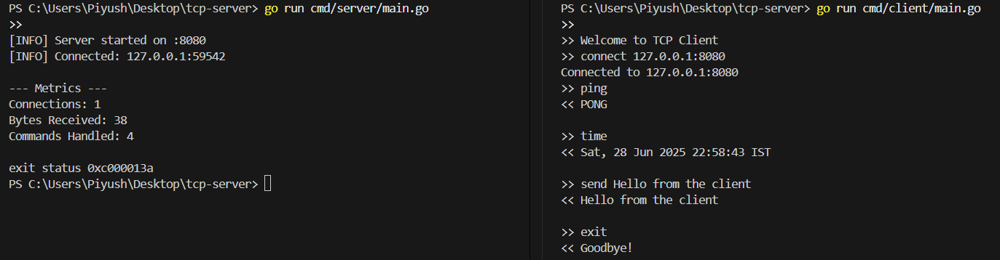

# TCP-Server

**TCP-Server** is a lightweight, interactive TCP server and CLI client built in Go.  
It supports real-time communication, command parsing, and basic metrics — ideal for learning, testing, or building network-based tools.

---

## Features

- TCP communication over localhost
- Interactive command parsing (`PING`, `ECHO`, `TIME`, `EXIT`)
- CLI-based REPL client with custom prompt
- Server-side metrics (connections, bytes, commands)
- Console + file logging (`logs/server.log`)
- Handles multiple clients concurrently

---

## Metrics & Logging
- Every 30 seconds, the server prints:

    -   Total connections

    - Bytes received

    - Commands handled

- Logs are written to:

    - Console ([INFO], [ERROR])

    - logs/server.log file

---

## Commands Overview

| CLI Command         | Action                                    |
| ------------------- | ----------------------------------------- |
| `connect <ip:port>` | Connect to server (e.g. `127.0.0.1:8080`) |
| `ping`              | Server replies with `PONG`                |
| `time`              | Server replies with current time          |
| `send <message>`    | Echo message back from server             |
| `exit`              | Disconnect and quit client                |

---
### THANKS FOR READING!🍁